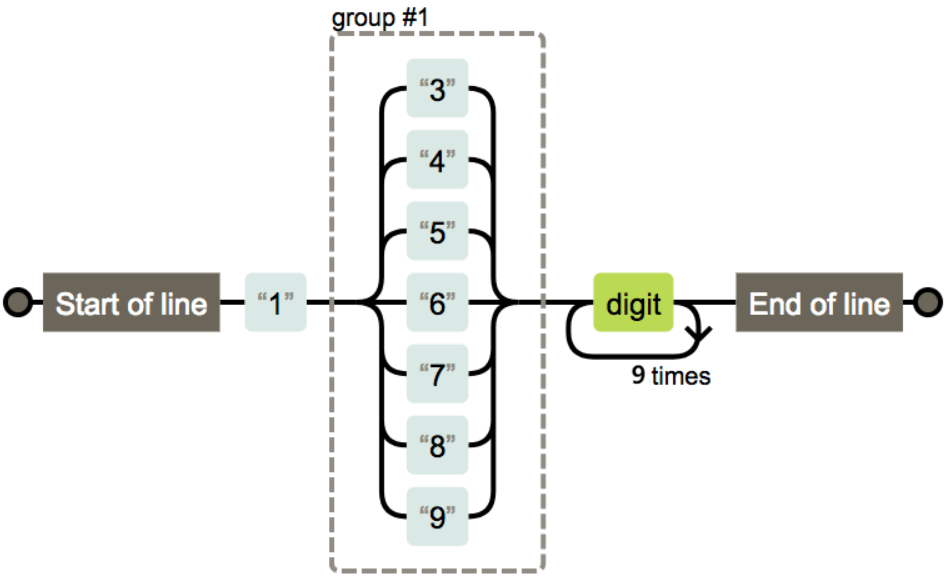

# 正则表达式 + GCC 编译选项技术报告

**课程**：开源软件设计与开发

**作者**：江羽

**专业**：软件工程

**班级**：硕士7班

**时间**：2024年12月

**GitHub地址**：https://github.com/Xixi2727/OpenSourceSoftware-Experiments

---

---

## 正则表达式

正则表达式（Regular Expression）是一种用于匹配和处理文本的强大工具。它通过定义特定的模式，可以快速搜索、替换或提取字符串中的内容。正则表达式广泛应用于文本处理、数据验证、日志分析等领域。

### 1. 概述
正则表达式是一种描述字符串模式的语法规则。它由普通字符（如字母、数字）和特殊字符（元字符）组成，用于定义匹配规则。正则表达式的主要功能包括：
- **匹配**：检查字符串是否符合特定模式。
- **查找**：在文本中搜索符合模式的子串。
- **替换**：将符合模式的子串替换为指定内容。
- **提取**：从文本中提取符合模式的子串。

其应用场景有：

- 数据验证：验证用户输入的邮箱、手机号、日期等格式是否正确。
- 文本搜索与替换：在文本编辑器中查找或替换特定内容。
- 日志分析：从日志文件中提取特定信息，如 IP 地址、时间戳等。
- 数据提取：从 HTML、JSON 等结构化文本中提取数据。
- 编程语言中的使用：在 Python、JavaScript、Java 等语言中处理字符串。

### 2. 基本语法

#### 2.1 字符匹配
- 普通字符：直接匹配自身，例如 `a` 匹配字符 `a`。
- 特殊字符：如 `.`、`*`、`+`、`?`、`()`、`[]`、`{}` 等，需用 `\` 转义。

#### 2.2 元字符
- `.`：匹配任意单个字符（除换行符外）。
- `^`：匹配字符串的开头。
- `$`：匹配字符串的结尾。
- `\d`：匹配数字字符（等价于 `[0-9]`）。
- `\w`：匹配字母、数字或下划线（等价于 `[a-zA-Z0-9_]`）。
- `\s`：匹配空白字符（空格、制表符、换行符等）。

#### 2.3 量词
- `*`：匹配前面的元素零次或多次。
- `+`：匹配前面的元素一次或多次。
- `?`：匹配前面的元素零次或一次。
- `{n}`：匹配前面的元素恰好 `n` 次。

#### 2.4 分组与捕获
- `()`：将表达式分组，并捕获匹配的内容。
- `(?:)`：分组但不捕获。

#### 2.5 选择符
- `|`：表示“或”关系，例如 `a|b` 匹配 `a` 或 `b`。

#### 2.6 断言
- `(?=...)`：正向先行断言。
- `(?!)`：负向先行断言。

### 3. 示例与实验

**邮箱验证**

```regex
^\w+([.-]?\w+)*@\w+([.-]?\w+)*(\.\w{2,3})+$
```

**日期格式（YYYY-MM-DD）**

```regex
^\d{4}-\d{2}-\d{2}$
```

**URL 匹配**

```regex
^(https?:\/\/)?([\da-z\.-]+)\.([a-z\.]{2,6})([\/\w \.-]*)*\/?$
```

**手机号码验证**

```regex
^1[3-9]\d{9}$
```

**提取 HTML 标签**

```regex
<(\w+)[^>]*>(.*?)<\/\1>
```

#### 实验

下面以中国大陆手机号码的正则表达式匹配进行说明：



上图中为使用正则表达式对中国大陆手机号进行和有效性校验的流程示意图。

其对应的正则表达式为：`^1[3-9]\d{9}$`

- 中国大陆手机号都是以数字1开头，正则表达式中`^1`即表示对手机号开头是否为1进行匹配。

- `[3-9]`表示对手机号第二位进行匹配，由于中国手机号10，11，12开头的号码一般用于特殊用途，因此对普通手机号进行匹配时不需要考虑。

- `\d{9}$` 表示对剩下的9位号码进行匹配，对于这9位一般没什么限制，所以使用`\d`匹配任意数字即可，`{9}`表示正好匹配9次。

下面在Linux中使用shell脚本测试使用正则表达式校验字符串是否符合中国大陆手机号码的格式，测试脚本代码见GitHub仓库中的Regex.sh，实验结果如下图所示：


### 4. 总结

正则表达式是一种功能强大的文本处理工具，广泛应用于数据验证、文本搜索、日志分析等场景。掌握正则表达式的基本语法和优化技巧，可以显著提高文本处理的效率和准确性。

---

---

## GCC

GCC（GNU Compiler Collection）是一套由 GNU 开发的开源编译器，支持多种编程语言（如 C、C++、Fortran 等）。GCC 提供了丰富的编译选项，可以帮助开发者优化代码性能、调试程序以及控制编译过程。

### 1. 概述

GCC 是 Linux 系统中最常用的编译器之一，具有以下特点：

- 支持多种编程语言。
- 跨平台支持（Linux、Windows、macOS 等）。
- 强大的优化能力。
- 可扩展性强，支持插件和自定义编译选项。

GCC 的编译过程分为以下步骤：

1. **预处理**：处理宏定义、头文件包含等（`-E`）。
2. **编译**：将源代码编译为汇编代码（`-S`）。
3. **汇编**：将汇编代码转换为目标文件（`-c`）。
4. **链接**：将目标文件与库文件链接生成可执行文件（`-o`）。

### 2. 编译选项

#### 2.1 基本选项

- `-o <file>`：指定输出文件名。
- `-c`：只编译源文件，生成目标文件（`.o`），不进行链接。
- `-E`：只进行预处理，输出预处理后的代码。
- `-S`：只编译生成汇编代码（`.s`）。

#### 2.2 优化选项

- `-O0`：关闭优化（默认选项）。
- `-O1`：基本优化，减少代码大小和执行时间。
- `-O2`：更高级的优化，包括指令重排、循环优化等。
- `-O3`：最高级别的优化，可能增加代码大小。
- `-Os`：优化代码大小。
- `-Ofast`：启用所有优化选项，包括可能违反严格标准的行为。

#### 2.3 调试选项

- `-g`：生成调试信息，用于 GDB 调试。
- `-ggdb`：生成更详细的调试信息，适用于 GDB。
- `-p`：生成性能分析信息（用于 `prof` 工具）。
- `-pg`：生成性能分析信息（用于 `gprof` 工具）。

#### 2.4 警告选项

- `-Wall`：启用所有常见警告。
- `-Wextra`：启用额外的警告。
- `-Werror`：将警告视为错误。
- `-Wno-<warning>`：禁用特定警告。

#### 2.5 链接选项

- `-l<library>`：链接指定的库。
- `-L<path>`：指定库文件的搜索路径。
- `-static`：静态链接库。
- `-shared`：生成共享库（`.so` 文件）。

### 3. 示例

#### 4.1 编译并调试程序

```bash
gcc -g -Wall -o main main.c
gdb ./main
```

#### 4.2 编译并优化程序

```bash
gcc -O2 -o main main.c
```

#### 4.3 编译并生成共享库

```bash
gcc -fPIC -shared -o libmylib.so mylib.c
```

#### 4.4 编译并指定标准

```bash
gcc -std=c11 -o main main.c
```

### 4. 总结

GCC 提供了丰富的编译选项，能够满足从基本编译到高级优化的各种需求。通过合理使用这些选项，开发者可以提高代码性能、调试效率以及生成目标文件的灵活性。

