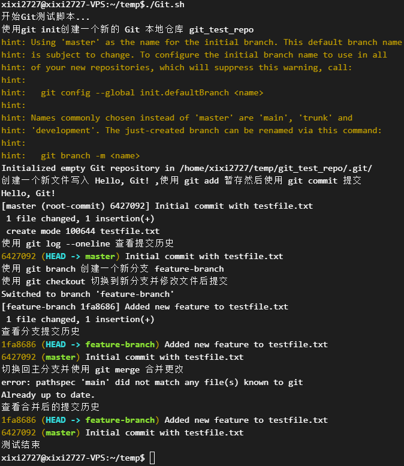

# 版本管理Git使用技术报告

**课程**：开源软件设计与开发

**作者**：江羽

**专业**：软件工程

**班级**：硕士7班

**时间**：2024年12月

**GitHub地址**：https://github.com/Xixi2727/OpenSourceSoftware-Experiments

---

---

## Git

Git 是一个分布式版本控制系统，广泛用于软件开发中的代码管理。Git 提供了强大的分支管理、合并、撤销更改等功能，旨在高效地处理从小型到大型项目的版本控制需求，使得团队协作和代码管理更加高效和灵活。

### 1. 基本概念

#### 1.1 仓库（Repository）
Git 仓库是 Git 用来存储项目历史记录的地方。它包含了项目的所有文件、分支、标签和提交历史。仓库可以是本地的，也可以是远程的（如 GitHub、GitLab 等）。

#### 1.2 提交（Commit）
提交是 Git 中的基本操作，表示对项目的一次更改。每次提交都会生成一个唯一的 SHA-1 哈希值，用于标识该提交。提交包含了更改的文件、提交信息、作者和时间戳等信息。

#### 1.3 分支（Branch）
分支是 Git 中的一种机制，允许开发者在同一个项目中并行开发不同的功能或修复不同的 bug。默认情况下，Git 会创建一个名为 `master` 或 `main` 的主分支。

#### 1.4 合并（Merge）
合并是将两个分支的更改合并到一起的操作。通常用于将特性分支的更改合并到主分支中。

#### 1.5 拉取（Pull）

拉取是从远程仓库获取最新更改并合并到本地仓库的操作。

#### 1.6 推送（Push）

推送是将本地仓库的更改上传到远程仓库的操作。

### 2. Git 工作流程

#### 2.1 基本工作流程

1. **初始化或克隆仓库**：使用 `git init` 或 `git clone` 初始化或克隆一个仓库。
2. **创建分支**：使用 `git branch` 创建一个新的分支来开发新功能或修复 bug。
3. **添加和提交更改**：使用 `git add` 和 `git commit` 将更改添加到暂存区并提交到本地仓库。
4. **合并分支**：使用 `git merge` 将特性分支的更改合并到主分支。
5. **推送更改**：使用 `git push` 将本地更改推送到远程仓库。


#### 2.2 分支管理策略

- **主分支（master/main）**：用于存放稳定的、可发布的代码。
- **开发分支（develop）**：用于日常开发，包含最新的开发进展。
- **特性分支（feature）**：用于开发新功能，完成后合并到开发分支。
- **修复分支（hotfix）**：用于紧急修复生产环境中的 bug，完成后合并到主分支和开发分支。


### 3. Git 常用命令

#### 3.1 初始化仓库
```bash
git init
```
在当前目录初始化一个新的 Git 仓库。

#### 3.2 克隆仓库
```bash
git clone <repository_url>
```
克隆一个远程仓库到本地。

#### 3.3 查看状态
```bash
git status
```
查看当前仓库的状态，包括未跟踪的文件、已修改的文件等。

#### 3.4 添加文件到暂存区
```bash
git add <file_name>
```
将指定文件添加到暂存区，准备提交。

#### 3.5 提交更改
```bash
git commit -m "commit message"
```
将暂存区的更改提交到本地仓库，并附上提交信息。

#### 3.6 查看提交历史
```bash
git log
```
查看当前分支的提交历史。

#### 3.7 创建分支
```bash
git branch <branch_name>
```
创建一个新的分支。

#### 3.8 切换分支
```bash
git checkout <branch_name>
```
切换到指定分支。

#### 3.9 合并分支
```bash
git merge <branch_name>
```
将指定分支的更改合并到当前分支。

#### 3.10 拉取远程更改
```bash
git pull origin <branch_name>
```
从远程仓库拉取指定分支的最新更改并合并到本地分支。

#### 3.11 推送本地更改
```bash
git push origin <branch_name>
```
将本地分支的更改推送到远程仓库。

### 4. 其他功能

#### 4.1 撤销更改
- **撤销工作区的更改**：
  ```bash
  git checkout -- <file_name>
  ```
- **撤销暂存区的更改**：
  ```bash
  git reset HEAD <file_name>
  ```
- **撤销提交**：
  ```bash
  git revert <commit_hash>
  ```

#### 4.2 标签
标签用于标记重要的提交，通常用于版本发布。
- **创建标签**：
  ```bash
  git tag <tag_name>
  ```
- **推送标签到远程仓库**：
  ```bash
  git push origin <tag_name>
  ```

#### 4.3 贮藏
贮藏用于临时保存工作区的更改，以便切换到其他分支。
- **贮藏更改**：
  ```bash
  git stash
  ```
- **恢复贮藏的更改**：
  ```bash
  git stash apply
  ```

#### 4.4 重置
重置用于将当前分支的 HEAD 指向指定的提交。
- **软重置**（保留工作区和暂存区的更改）：
  ```bash
  git reset --soft <commit_hash>
  ```
- **硬重置**（丢弃工作区和暂存区的更改）：
  ```bash
  git reset --hard <commit_hash>
  ```

### 5. 实验

下面在Linux中使用shell脚本测试使用Git对本地仓库进行一系列操作，测试脚本代码见GitHub仓库中的Git.sh，实验结果如下图所示：



### 6. 结论

Git 是一个功能强大且灵活的版本控制系统，适用于各种规模的软件开发项目。通过掌握 Git 的基本概念、常用命令和工作流程，开发者可以更高效地管理代码，并与团队成员协作。此外，Git 的高级功能如撤销更改、标签、贮藏和重置等，进一步增强了其灵活性和实用性。
